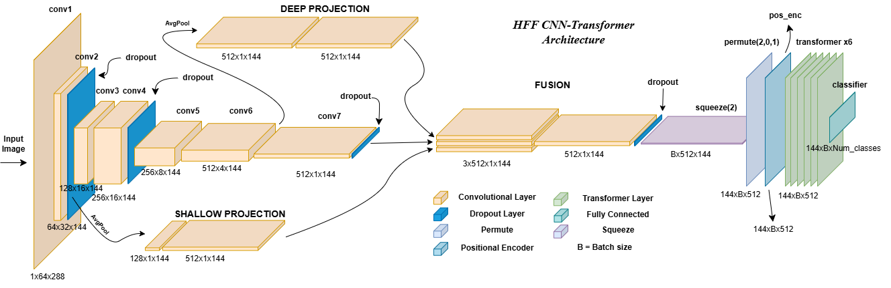

# HFF-CNN-Transformer OCR

A PyTorch-based project for printed text recognition using a CNN–Transformer architecture with Hierarchical Feature Fusion (HFF), trained end-to-end with CTC loss on a fully synthetic dataset.

This project was developed as part of a research [paper](HFF_CNN_Transformer_OCR_SICAAI2026.docx) submitted to the **Fifth Serbian International Conference on Applied Artificial Intelligence (AAI2026)**.

---



## Overview

Two models are implemented and compared under identical training conditions:

- **CNN-Transformer** — baseline model with a 4-block CNN backbone and a 6-layer Transformer encoder
- **HFF-CNN-Transformer** — proposed model that fuses feature maps from shallow, deep, and final CNN layers before the Transformer encoder, with an additional adaptive sequence masking mechanism

| Metric | CNN-Transformer | HFF-CNN-Transformer |
|---|---|---|
| Best Val CER | 2.60% (epoch 14) | 2.39% (epoch 13) |
| Test CER | 2.62% | 2.44% |
| Test Loss | 0.0622 | 0.0570 |
| Training Time | 62.22 min | 67.22 min |
| Parameters | ~24M | ~24M |

The HFF model achieves a **6.87% relative improvement** in test CER over the baseline.

---

## Project Structure

```
├── config.py                          # All hyperparameters and constants
├── dataset/
│   ├── augmentation.py                # Augmentation functions
│   ├── fonts/                         # 14 TrueType fonts used for rendering
│   ├── english_words.txt              # 100k English words for text generation
│   ├── images/                        # Generated training images (not tracked)
│   └── labels.csv                     # Image filenames and ground truth labels
├── models/
│   ├── model_cnn_transformer.py       # Baseline CNN-Transformer model
│   └── model_hff_cnn_transformer.py   # Proposed HFF-CNN-Transformer model
├── images_generator.ipynb             # Synthetic dataset generation
├── train_cnn_transformer.ipynb        # Training script for baseline model
├── train_hff_cnn_transformer.ipynb    # Training script for HFF model
├── models_testing.ipynb               # Visual comparison of model predictions
└── saved_models/                      # Saved checkpoints (not tracked)
```

---

## Dataset

The dataset consists of **100,000 synthetically generated grayscale images** at 288×64 pixels. Text content is either a random string sampled from a 63-character alphabet (probability 0.8) or one to two real English words (probability 0.2), with a maximum length of 12 characters.

Images are rendered using 14 diverse TrueType fonts and split into three augmentation difficulty tiers:

| Tier | Share | Augmentations |
|---|---|---|
| Easy | 20% | Noise, rotation ±1° |
| Medium | 60% | Noise, blur, contrast, gamma, brightness, rotation ±2° |
| Hard | 20% | All above + perspective distortion, rotation ±3° |

Dataset generation takes approximately 10 minutes on a standard CPU.

---

## Training

Both models are trained under identical conditions:

| Hyperparameter | Value |
|---|---|
| Batch size | 128 |
| Epochs | 15 |
| Peak learning rate | 7×10⁻⁵ |
| Weight decay | 10⁻² |
| Warmup epochs | 3 |
| LR schedule | Cosine decay to 1% of peak |
| Optimizer | AdamW |
| Loss function | CTC (blank index 0) |
| Gradient clip norm | 5.0 |
| Hardware | NVIDIA L4 GPU |
| Precision | float16 (AMP, training only) |

The dataset is split 80% / 10% / 10% for training, validation, and test. The checkpoint with the lowest validation CER is saved and used for final evaluation.

---

## Requirements

```
torch
torchvision
Pillow
numpy
pandas
matplotlib
```

---

## Citation

If you use this work, please cite the associated conference paper.
